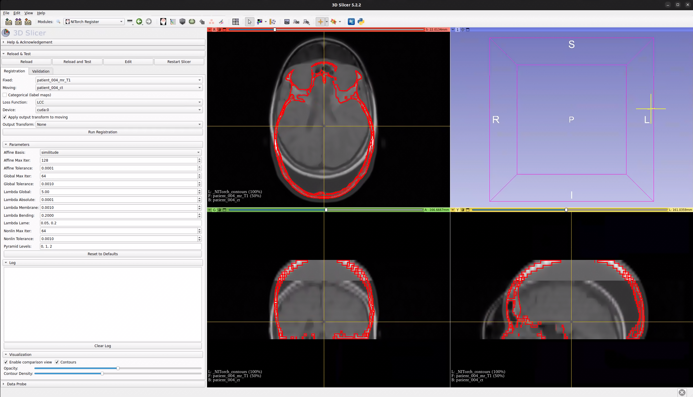

# NITorch Register: 3D Slicer Module for Image Registration

GPU-accelerated affine + nonlinear 3D image registration powered by [NITorch](https://github.com/balbasty/nitorch) in [3D Slicer](https://download.slicer.org/).



## Prerequisites

- 3D Slicer >= 5.x
- NVIDIA GPU (optional but recommended for faster registration)

## Installation

> Distribution via the Slicer Extensions Manager is planned (the repository
> includes `CMakeLists.txt` and `SlicerNitorch.s4ext` for submission to the
> [Extensions Index](https://github.com/Slicer/ExtensionsIndex)). Until then,
> install manually with the steps below.

### 1. Install Python dependencies in Slicer

Open 3D Slicer's Python console (`View > Python Console`) and run:

```python
pip_install("torch_interpol>=0.3.0")
pip_install("git+https://github.com/balbasty/nitorch.git@master")
```

> **Important:** install nitorch as a regular (non-editable) package. Using `pip install -e ./nitorch` can silently shadow the install when the SlicerNitorch module sits next to a `nitorch/` source repo (see [Troubleshooting](#troubleshooting)).

#### Optional

For increased acceleration on the GPU, nitorch needs its C++/CUDA extensions compiled against Slicer's bundled PyTorch. From a shell on the same machine, with Slicer closed and a matching GCC + the CUDA toolkit on PATH:

```bash
cd /path/to/nitorch-source
NI_COMPILED_BACKEND=C /path/to/Slicer/bin/PythonSlicer -m pip install --no-build-isolation .
```

Without `NI_COMPILED_BACKEND=C`, nitorch falls back to a pure-PyTorch TorchScript backend (slower but no compilation required).

### 2. Add the module path

1. Open 3D Slicer
2. Go to **Edit > Application Settings > Modules**
3. Under **Additional module paths**, click **Add** and browse to:
   ```
   /path/to/SlicerNitorch
   ```
4. Restart 3D Slicer

The module will appear under **Modules > Registration > NITorch Register**.

## Usage

The module has two tabs: **Registration** and **Validation**.

### Registration Tab

1. Load fixed and moving volumes/labels into Slicer
2. Open **NITorch Register** from the Modules menu
3. Select the fixed and moving volumes/labels
4. Check **Categorical** if inputs are label maps (restricts loss to Dice)
5. Choose a loss function (LCC, MSE, NMI, or Dice)
6. Select the computation device (CPU or CUDA; defaults to the first CUDA device if available)
7. Click **Run Registration**

The module will run affine + nonlinear (SVF) registration and create a grid transform node. If **Apply output transform to moving** is checked, the transform is automatically applied to the moving volume.

> **Note:** registration currently runs on Slicer's main thread, so the user
> interface is unresponsive while a run is in progress. Progress is printed to
> the **Log** section; wait for "Registration complete" before interacting with
> Slicer again.

### Output Transform

Each registration run creates a new grid transform named, e.g., `NITorch_001_lcc_fixed_to_moving` (with incrementing counter and loss name). Use the **Output Transform** selector to switch between previously computed transforms.

### Parameters

The **Parameters** section exposes registration settings. The effective nonlinear regularization for each term is `Lambda Global × Lambda <term>`.

| Parameter | Default | Description |
|---|---|---|
| Affine Basis | similitude | Degrees of freedom (translation, rotation, rigid, similitude, affine) |
| Affine Max Iter | 128 | Max iterations for affine optimizer per pyramid level |
| Affine Tolerance | 0.0001 | Convergence tolerance for affine optimizer |
| Global Max Iter | 64 | Max iterations for interleaved affine/nonlinear optimization |
| Global Tolerance | 0.0010 | Convergence tolerance for outer loop |
| Lambda Global | 5.0 | Global scaling factor multiplied with all individual penalty values |
| Lambda Absolute | 0.0001 | Penalty on absolute displacements (0th order) |
| Lambda Membrane | 0.0010 | Penalty on membrane energy (1st order) |
| Lambda Bending | 0.2000 | Penalty on bending energy (2nd order) |
| Lambda Lame | 0.05, 0.2 | Lame constants for linear elastic energy (two comma-separated values) |
| Nonlin Max Iter | 64 | Max iterations for nonlinear optimizer per pyramid level |
| Nonlin Tolerance | 0.0010 | Convergence tolerance for nonlinear optimizer |
| Pyramid Levels | 0, 1, 2 | Coarse-to-fine pyramid levels (0 = finest) |

### Log

The **Log** section shows real-time registration progress including loss values and iteration counts.

### Visualization

The **Visualization** section provides tools for comparing fixed and moving volumes after registration. Controls are grayed out until both fixed and moving volumes are selected.

- **Enable comparison view** — overlays fixed (background) and moving (foreground) in the slice views with alpha blending. Links slice views and enables the crosshair. Unchecking restores the previous view layout.
- **Contours** — overlays iso-contour edges of the moving image on the fixed image (red outlines)
- **Opacity** slider — controls the blend ratio (0 = fixed only, 100 = moving only)
- **Contour Density** slider — controls the number of iso-contour levels (enabled when Contours is checked)

### Validation Tab

The **Validation** tab computes Dice overlap scores between fixed and moving segmentations:

1. Select a **Fixed** reference volume (typically the fixed image from registration)
2. Select **Fixed Labels** and **Moving Labels** (segmentation nodes)
3. Optionally select an **Output Transform** to evaluate (grid transform from registration)
4. Click **Compute Dice**

The **Summary** table shows the mean Dice (Before and After) for each computed result. Use the **Result** selector to view per-label Dice scores for a specific run. The **Mean Dice** label shows the selected result's mean. Green highlighting indicates improvement, red indicates degradation.

Results accumulate across runs — select different transforms and click Compute Dice again to compare multiple registrations. Use **Clear Results** to reset.

## Troubleshooting

### `ImportError: cannot import name 'compiled_backend' from 'nitorch' (unknown location)`

Two known causes:

**(a) Stale `torch_interpol`.** Versions before 0.3.0 use a raw `@torch.jit.script` decorator that collides with itself under recent PyTorch as torch.jit's compilation unit accumulates type registrations. Fix: upgrade in Slicer's Python — `pip_install("torch_interpol>=0.3.0")` — and fully restart Slicer.

**(b) Editable nitorch install shadowed by a sibling source dir.** If nitorch was installed with `pip install -e /path/to/nitorch-source` *and* the SlicerNitorch module's parent directory contains a `nitorch/` source repo as a sibling, Slicer (which auto-adds the parent of "Additional module paths" to `sys.path`) causes Python's `PathFinder` to treat the sibling `nitorch/` as a namespace package, shadowing the editable install. The symptom is misleading: `import nitorch` appears to succeed but produces an empty namespace package, and any later `from nitorch import compiled_backend` fails as above. Fix: reinstall nitorch non-editable (see step 1 above), then fully restart Slicer.

## Development

### Running the self-tests

The module ships a self-test class (`NITorchRegisterTest`). To run it in Slicer:
open the **Reload and Test** panel (Developer Tools) and click **Reload and
Test**, or go to **Modules > Testing > Self Tests**, select **NITorchRegister**,
and run. The Dice and grid-transform tests need only numpy/VTK; the
end-to-end registration smoke test runs if nitorch is installed and is skipped
cleanly otherwise.

